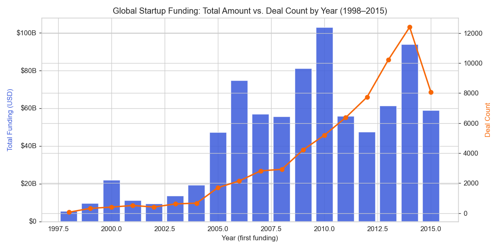
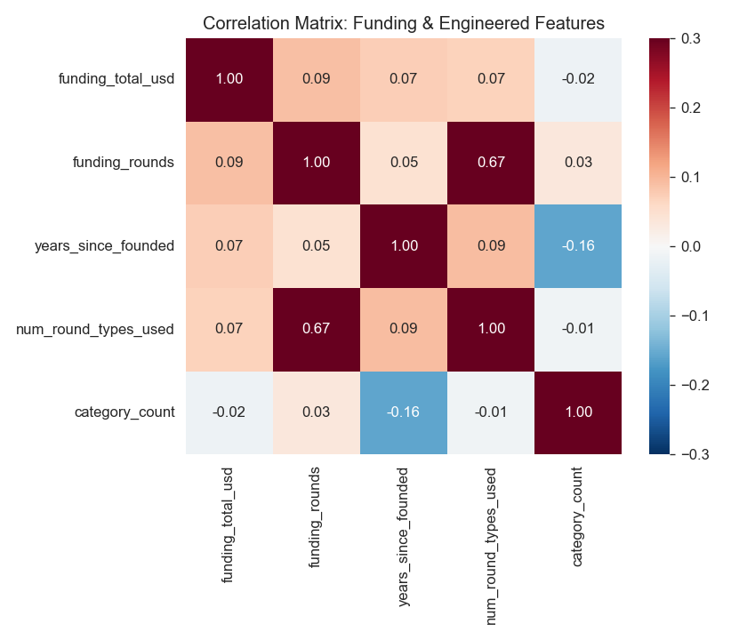
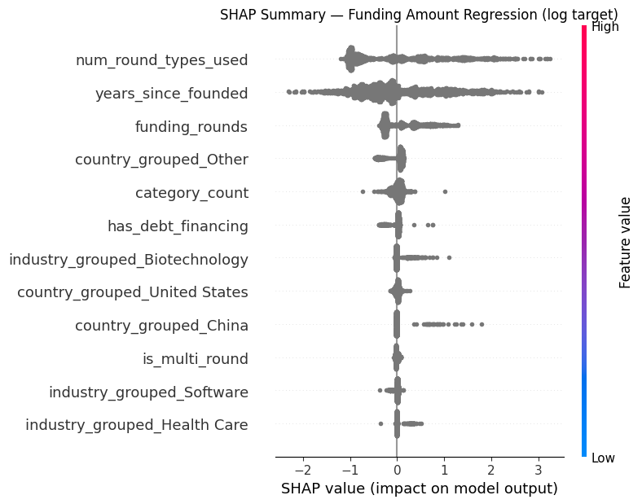

## Project Demo

### Streamlit Application

A short walkthrough of the Streamlit application is included here:
'docs/app.mp4'


### Power BI Dashboard

The complete Power BI dashboard is included in:
'powerbi/startup_funding_bi_platform.pbix'

Open it with Power BI Desktop.

# Startup Funding & Business Intelligence Platform

     

This is a full analytics project I built around 67,098 real startups and $833.4B in disclosed funding. It goes from raw Crunchbase CSVs, through a PostgreSQL database, into statistics, machine learning, and an executive Power BI dashboard.

I wanted this to cover the whole analytics stack, not just a notebook with some charts — data engineering, SQL, stats, ML, and BI, the way these things actually get built.

**Relevant for:** Data Analyst · BI Developer · Analytics Engineer · Data Scientist roles.

---

## A few things this project actually produced

| Funding trend over time | Correlation heatmap | SHAP — regression model |
|---|---|---|
|  |  |  |

More charts in [`docs/eda_charts/`](docs/eda_charts/), [`docs/ml_charts/`](docs/ml_charts/), [`docs/stats_charts/`](docs/stats_charts/), and additional supplementary figures generated during the notebook build in [`docs/extra_charts/`](docs/extra_charts/).

---

## Why this isn't just another "startup funding" notebook

A lot of portfolio projects on this topic stop at a notebook with a few plots. I wanted mine to go further:

- I used **real, cited datasets** — nothing synthetic (see [Data Sources](#data-sources) below)
- I kept the **bugs I actually ran into**, instead of hiding them — a category-parsing bug that made 77% of a column look missing when it wasn't, a join that silently duplicated rows because of a fan-out, and a stored procedure that failed because Postgres doesn't carry over the session `search_path`
- I wrote down my **assumptions and limits** instead of glossing over them — for example, I anchor the analysis to 2015 instead of "today," because the source data itself is historical, and I scoped the Investor Intelligence dashboard page to unicorns only because that's genuinely all the data supports
- I ran real statistical tests (ANOVA, Tukey HSD, chi-square, Breusch-Pagan, Shapiro-Wilk) and checked the assumptions behind them instead of assuming they hold
- I compared several ML models with cross-validation and tuning, instead of fitting one model once and calling it done

---

## What I found

- The **US accounts for 72.6%** of global disclosed funding and **71.3%** of matched unicorns. That concentration shows up at every level I looked at, down to individual cities.
- **Median deal size dropped about 19x**, from $11.8M in 2005 to $630K in 2014. So over this window, the market got a lot more *accessible*, not just bigger.
- **Multi-round startups exit at 2.1x the rate** of single-round startups (16.6% vs 8.0%, t-test p<0.001). This was the strongest signal I found — it shows up consistently in the stats, the regression model, the classification model, and the clustering.
- A tuned XGBoost model explains **51.5% of the variance** in funding amount (R²). A Random Forest classifier predicts exit likelihood with an ROC-AUC of **0.800**.
- Full write-ups: [`docs/eda_report.md`](docs/eda_report.md) (101 findings), [`docs/statistical_analysis_report.md`](docs/statistical_analysis_report.md), [`docs/ml_report.md`](docs/ml_report.md)

---

## How it's put together

```
Raw Data (Kaggle: Crunchbase snapshot, unicorn list)
        │
        ▼
Python ETL (extract → validate → clean → transform)
        │
        ▼
PostgreSQL 16 — Star Schema
  (fact_startup_funding, fact_funding_by_type +
   dim_startup, dim_geography, dim_industry, dim_date,
   dim_round_type, dim_investor)
        │
   ┌────┼─────────────────┬──────────────────┐
   ▼    ▼                 ▼                  ▼
SQL Views/     Python EDA &          Python ML
Materialized   Statistical            (regression,
Views          Analysis               classification,
   │                                  clustering, SHAP)
   └──────────────┬───────────────────────┘
                   ▼
         Power BI (43 DAX measures,
         7-page executive dashboard)
                   │
                   ▼
         GitHub Portfolio + Documentation
```

---

## Tech stack

Python 3.12 (pandas, scikit-learn, XGBoost, SHAP, statsmodels, scipy), PostgreSQL 16, SQL (CTEs, window functions, materialized views), Power BI (DAX, star schema modeling), Git.

---

## Data sources

| Dataset | Source | Rows | License note |
|---|---|---|---|
| StartUp Investments (Crunchbase) | [Kaggle](https://www.kaggle.com/datasets/arindam235/startup-investments-crunchbase) | 54,294 | Public Kaggle dataset, Crunchbase open snapshot |
| Big Startup Success/Fail Dataset | [Kaggle](https://www.kaggle.com/datasets/yanmaksi/big-startup-secsees-fail-dataset-from-crunchbase) | 66,368 | Public Kaggle dataset |
| Global Unicorn Companies | [Kaggle](https://www.kaggle.com/datasets/parthpatil2023101141/cb-insights-global-unicorn-companies) | 1,359 | Public Kaggle dataset, CB Insights-sourced |

**One thing worth flagging:** this is a historical Crunchbase snapshot, with funding activity concentrated between 1995 and 2015. Any "trend" or "growth" language in this project is describing that window — not live 2026 market conditions.

---

## Project structure

```
startup-funding-bi-platform/
├── data/{raw,interim,processed,warehouse}/
├── src/
│   ├── data_engineering/    # extract, clean, transform, validate
│   ├── database/            # schema.sql, etl_load.py, queries/
│   ├── eda/                 # compute_eda_stats.py, generate_charts.py
│   ├── stats/                # statistical_analysis.py, diagnostics
│   ├── ml/                  # regression, classification, clustering, SHAP
│   └── utils/                # logger
├── powerbi/                 # dax_measures.dax, dashboard_specification.md
├── streamlit_app/            # browser-based version of the project (10 pages)
├── notebooks/                # 13 sequential notebooks mirroring the pipeline
│                             # (profiling → cleaning → EDA → stats → ML → interpretation → conclusion)
├── docs/                    # reports, data dictionary, charts
├── config/config.yaml
└── requirements.txt
```

---

## Running it yourself

```bash
pip install -r requirements.txt

# Data engineering
python src/data_engineering/clean.py
python src/data_engineering/validate.py
python src/data_engineering/transform.py

# Database
psql -f src/database/schema.sql
python src/database/etl_load.py
psql -f src/database/queries/business_queries.sql

# Analysis
python src/eda/compute_eda_stats.py
python src/stats/statistical_analysis.py

# ML
python src/ml/funding_regression.py
python src/ml/success_classification.py
python src/ml/clustering.py
python src/ml/explainability.py
```

For Power BI: open Power BI Desktop, import the tables from `data/warehouse/` (or connect it live to PostgreSQL), then follow `powerbi/dashboard_specification.md`.

---

## Live version (Streamlit)

Power BI is the primary dashboard for this project, and I also built a Streamlit application so the project can be explored in a browser.

- Streamlit App: `streamlit_app/`
- Power BI Dashboard: `powerbi/startup_funding_bi_platform.pbix`
- App walkthrough video: `docs/app.mp4`

Setup instructions are available in `streamlit_app/README.md`.

## Docs

- [`docs/data_quality_report.md`](docs/data_quality_report.md) — what I found and fixed while cleaning the data
- [`docs/data_dictionary.md`](docs/data_dictionary.md) — star schema reference
- [`docs/eda_report.md`](docs/eda_report.md) — 101 findings
- [`docs/statistical_analysis_report.md`](docs/statistical_analysis_report.md) — hypothesis tests, regression diagnostics
- [`docs/ml_report.md`](docs/ml_report.md) — model comparisons, SHAP, clustering
- [`powerbi/dashboard_specification.md`](powerbi/dashboard_specification.md) — how the dashboard is built, page by page
- [`docs/business_glossary.md`](docs/business_glossary.md)
- [`docs/interview_prep.md`](docs/interview_prep.md)
- [`notebooks/`](notebooks/) — 13 sequential notebooks (`01_Project_Overview` → `13_Conclusion`) mirroring the pipeline step by step, useful if you'd rather review the build in order than jump straight to the reports


## Future work

- Deploy the Streamlit app publicly (Streamlit Community Cloud)
- Add fuzzy name-matching for unicorn linkage (`rapidfuzz`) to improve the ~19% match rate
- Refit the OLS regression with heteroscedasticity-robust standard errors (`HC3`)

## Author

**Md Imamuddin**
GitHub: https://github.com/Mdimam0786 · LinkedIn: https://www.linkedin.com/in/md-imamuddin-5457391a9/
Email: mdimamuddinf786@gmail.com

If you have questions about any part of this build — the schema decisions, the stats, the modeling trade-offs — I documented my reasoning throughout `docs/` and I'm happy to walk through any of it.
